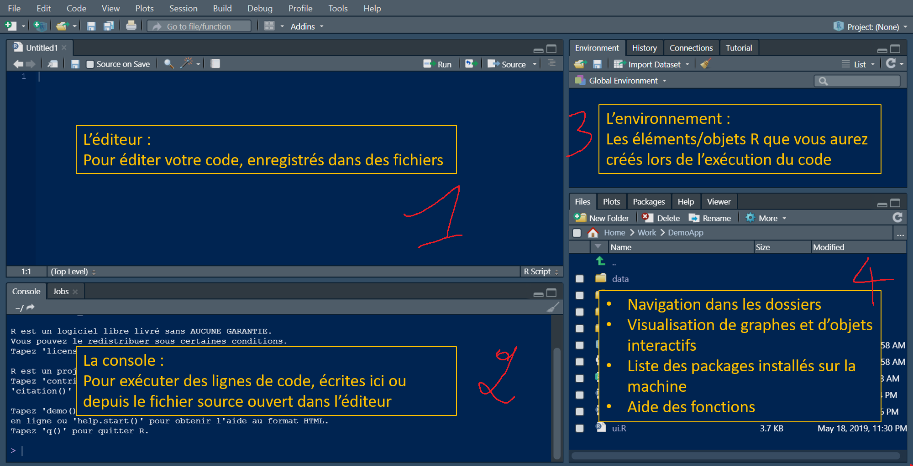

```{r setup, include=FALSE}
knitr::opts_chunk$set(echo = TRUE)
```

## Qu'est - ce que R ? 

Développé par **Ross Lhaka** et **Robert Gentleman** à l'université d'Auckland, en Nouvelle-Zélande dans les années 1990, R est d'abord un langage de programmation et un environnement logiciel "Open source".  Il a été conçu pour l'**analyse statistique , la manipulation des données et la visualisation**. L'appelation **"Open source"** désigne un logiciel ou un programme dont la conception,le code source et les droits de distribution sont ouverts et accessibles à tous. 

A cet effet, R dispose d'une grande communauté d'utilisateurs. EN naviguant sur le web , vous trouverez des forums, des listes de diffusion, ou encore des groupes dédiées à R dans lesquels vous trouverez réponse à la plupart de vos inquiétudes. 

De plus, R est largement utilisé dans le monde universitaire et dans le monde de la recherche là où on fait beaucoup appel à des préceptes statistiques. 

## Pourquoi R ?

Il existe pluisieurs langages de programmation des plus simples au plus complexe. Pourquoi alors le choix d'écrire un livre sur R ? 
Il y'a des années maintenant que j'ai pour ambition d'initier un public non initié aux concetps de l'Analytics. Cependant, R est le langage qui se rapproche le plus des fomules **Excel** que nous utilisons depuis le collège. C'est pour cette raison pédagogique et linéaire que mon choix porte sur R d'autant plus que c'est le prmier langage que j'ai appris durant mes années de licence. 

## Que contient ce livre ?
Ce livre a l'avantage d'être concis et à la fois. Il comprendra 7 chapitres allant de l'installation de R Studio, aux utilisations avancées de R à savoir la création des fonctions, l'utlisation des boucles en passant par l'analyse statistique et la visualisation des données. 

Comme je le disais en Introduction, R est un logiciel open source. Durant le déroulé de ce livre, nous utiliserons principalement des "Packages" , c'est à dire des bibliothèques conçues par la communauté et regroupant plusieurs fonctionnalités. 

## Chapitre 1: Installation et Configuration de R

Vous pouvez installer **R** sur les principales distributions à savoir Windows, macOS, et Linux.  

### Téléchargement de R:
Pour télécharger le programme d'installation de R, rendez-vous sur le site officiel du [projet R](https://www.r-project.org/).  

- Cliquez sur le lien de téléchargement correspondant à votre système d'exploitation (Windows, macOS, Linux).  
- Choisissez un miroir de téléchargement proche de votre emplacement géographique en cliquant sur le lien [CRAN](https://cran.r-project.org/mirrors.html). Le lien vers la France est disponible [ici](https://pbil.univ-lyon1.fr/CRAN/).  
- Téléchargez le fichier d'installation de R correspondant à votre système d'exploitation.  

### Installation de R  

- Exécuter le fichier d'installation téléchargé  
- Suivez les instructions de l'assisstant d'installation pour configurer R sur votre système d'exploitation.  
- Choississez votre repertoire d'installation et les options de configuration selon vos préférences.  

### Configuration de l'environnement de développement intégré (IDE Studio)  
un IDE fourni un ensemble d'outils , d'éditeurs de code, de débogueurs , de consoles et d'autres fonctionnalités pour aider les utilisateurs à écrire, tester et déployer leur code de manière plus éfficace. Un IDE à l'avantage d'être ludique et permet l'autocomplétion des commandes écrites. 

R dispose d'un IDE spécifique appelé **Rstudio**. Vous pouvez également éxécuter du code R sur divers autres IDE comme Notepad++, VScode, etc.  
Pour télécharger l'IDE Rstudio , rendez-vous sur le site officiel de Rsudio (https://www.rstudio.com/). Cliquez sur **Download RStudio** et choisissez votre système d'exploitation. Puis installez Rstudio en suivant les instructions d'installation spécifiques à votre système d'exploitation.  

### Première prise en main: Hello word!!  
Une fois R et Rstudio installés , lancez R ou Rstudio. Tapez une commande basique du type *print('Hello Word')* dans la console. Si ceci s'exécute sans message d'erreur. Alors votre installation est correcte. 

```{r Hello word}
print("Hello word")
```

### Présentation de l'environnement RStudio  
L'interface de Rstudio se présente en 4 blocs à savoir :  

- Bloc 1:  L'éditeur de texte  
Le Bloc 1 permet d'écrire votre code **R** de façon propre, lisible. Elle permet de garder une trace de votre script.

- Bloc 2:  La console  
La console permet d'éxécuter votre script R. Un message d'erreur s'affichera lorsque votre code contient des erreurs.

- Bloc 3:  L'environnement  
Le bloc 3 permet de stocker vos variables crées lors d'une session R. Elle donne également un aperçu de toutes les données importées ou crées.

- Bloc 4: Liste des dossiers/Packages/Visualisation des graphes/Aide    
Le Bloc 4 permet tout d'abord de naviguer dans les dossiers de votre ordinateur à travers l'onglet **Files**. l'onglet **Packages** de ce bloc donne la liste de tous les packages disponibles sur votre version de R.Dès lors, vous pouvez choisir de les installer pour une utilisation future.  
L'onglet **Plot** permet une visualisation des graphiques que vous affichez. Et enfin **Help** est l'aide native de R. Elle donne une documentation complète de toutes les fonctions disponibles sous R.

  

## Bases de R et langage native 
Lorsqu'on apprend une nouvelle langue , nous sommes excités à l'idée de pouvoir employer les. mots appris. Tel est le cas pour tout langage de programmation. Le logiciel ne comprend que la langue qui lui est dédié. Donc si vous ne voulez pas voir votre console pleine de "messages d'erreur", vous avez intérêt à écrire dans une langue dans laquelle elle comprend.  

Vous allez donc apprendre à écrire vos premières lignes de code.  

### Syntaxe de base  
Les syntaxes de base de R sont très simples. Nous avons:  
1. L'assignation de valeurs à une variable  
Pour assigner une valeur à une variable , on donne un nom à la variable et on lui "attribue" la valeur que l'on souhaite. La règle à retenir est de ne pas laisser d'espace dans le nom de votre variable. Par exemple, <span style="color:red">"Ma variable"</span> n'est pas un nom de variable valide mais <span style="color:#006400">"Ma_variable"</span> si.  

Par exemple , si on veut assigner la valeur 5 à une variable "nombre" , on écrira:   
```{r assignatation variable}
nombre <- 5
#ou 
nombre = 5
```

2. Affichafe des résultats  
Pour afficher les résultats ou le contenu d'une variable , il suffit de saisir simplement le nom de la variable ou de le précéder de la fonction **print** .  
```{r affichage de la variable}
nombre
#ou
print(nombre)
```
3. Les commentaires  
Lorsqu'on écrit du code , nous mettons des commentaires pour faciliter la compréhension de notre script. Ces commentaires ne sont pas éxécuter par la console. Pour écrire un texte en commentaire , il suffit de le précéder du symbole **#**.
```{r}
#Ceci est un commentaire
```
4.  Les opérateurs mathématiques
Comme sur une calculatrice, R prend en charge toutes les opérations mathématiques à savoir l'addition (+), la multiplication (x), la soustraction (-), la division (/) et la puissance (^).  
```{r}
#SUpposons les variables a et b telles que:
a <- 20
b <- 3
#Alors:
c <- a + b   #Additon
d <- a - b   # Soustraction
e <- a * b   # Multiplication
f <- a / b   # Division
g <- a ^ b   # Puissance
i <- a %% b # a modulo b ou le reste de la division de a par b

```
A noter qu'il est possible de réliser les opérations mathématiques les plus complexes:  
```{r}
#Supposons la variabe a telle que:
a <- 5
#Alors
b <- log(a)   #logarithme néperien (ln) de a 
c <- log10(a) #logarithme à base 10 de a 
d <- exp(a)   #Exponentielle de a
e <- sqrt(a)  #Racine carrée de a
```
##  Les types de variables en R  
Lorsqu'on manipule des données, la première chose à faire est de se rassurer de leur types. R dispose de plusiers types de données que nous allons découvrir ensemble.  
1. Numeric  
2. Integer  
3. Character  
4. Logical  

## Les structures de données en R
1. Les vecteurs    
2. Les matrices  
3. Les listes  
4. Les Factors
5. Les Data frames  

## Manipulation des données avec R  
### Importation des données R  
### Exploration des données  
### Manipulation des données
### Statistiques descriptives avec R
### Netoyage des données  

##  Visualisation des données avec R  
### Introduction aux graphiques de base  
### Graphiques avancés avec ggplot2  

## Programmation avancées avec R  
### Les boucles
### Les fonctions